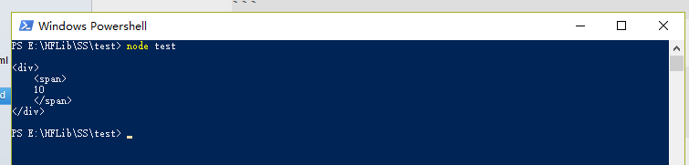
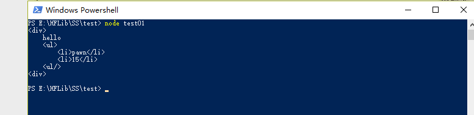

## SS 前端模板引擎.(一)

前端MVVM 模式太好用了，完全摆脱了意大利面条式的代码。
个人认为，所有MVVM 的框架基础就是一个高性能的JS模板引擎,它极大简化了 DOM 操作, 使页面渲染和业务逻辑彻底分离.
为了理解模板引擎原理(zhaungbi),所以我折腾了一个简化版的模板引擎.可以实现数据绑定,三元表达式, for 循环和 if 判断.
如何实现三元表达式, for 循环和 if 判断,将在下一篇介绍.


### HTML 模板

下面是我定义好的html 模板字符串。
```
var template = `
<div>
    <span>
    {{number}}
    </span>
</div>
`;
```

这是我的数据
```
var scope ={
    number:10
}
```

好了，现在怎么把数据渲染到模板上面呢？

很自然的想到 正则表达式

### 正则替换
第一步 ，我们可以使用字符串的replace 函数。
这是正则
```
   var regex = /\{\{([A-Za-z_\$]+[A-Za-z0-9_\$]*)\}\}/g;
```

好了，现在编写一个函数，我把我的模板引擎就叫 SS。

```
var SS = (function() {
  var regex = /\{\{([A-Za-z_\$]+[A-Za-z0-9_\$]*)\}\}/g;
  var result = "";

  var ss = {};
  ss.Render = function(template, scope) {
    result = template.replace(regex, function(a, b) {
      b = b.trim();
      return scope[b];
    })
    return result;
  }
  return ss;
})()
```

测试一下
```
SS.Render(template,scope);
```

这是结果


但是，仅仅渲染一级属性的模板引擎有什么用呢？

### 渲染多级属性

在这里，渲染多级属性还是分为两种。

- 变量属性 （不知道这么称是否准确，就是类似于 person.name）
- 数组属性  （数组元素,key 必须是数字类型）

这里，先解决变量属性

#### 变量属性

首先,我们需要一个新的正则表达式
```
      var regex = /\{\{([A-Za-z_\$]+(\.[A-Za-z_\$]+|[A-Za-z0-9_\$])*)\}\}/g;
```

> 正则写的很烂,如果发现错误希望不吝赐教

html 模板

```
var template = 
`
<div>
    {{title}}
    <ul>
        <li>{{item.name}}</li>
        <li>{{item.age}}</li>
    <ul/>
<div>
`
```

按照上面模板匹配的数据

```
var scope = { 
   title:"hello",
   item:{
    name:'pawn',age:15
    }
}
```

渲染函数
```
ss.Render = function(origin, scope) {
    result = origin.replace(regex, function($, $1) {
        $1 = $1.trim();
        var innerdata = scope;
        var items = $1.split('.');
        for (var i = 0; i < items.length; i++) {
            innerdata = innerdata[items[i]];
        }
        return innerdata;
    });

    return result;
}

```

> 在这里考虑到元素的属性,所以将{{}} 中包含字符'.' 也匹配出来,再使用'.'分割,然后依次向下寻找

测试代码
```
var res = ss.Render(template, scope);
console.log(res);
```

这是结果:


貌似这个模板引擎已经具有雏形了


#### 数组属性

在这里,要是正则能够匹配上[] ,而且里面必须是数字

```
 var regex = /\{\{([A-Za-z_\$]+(\[\d+\]+|\.[A-Za-z_\$]+|[A-Za-z0-9_$])*)\}\}/g;
```
这个正则主要是匹配形如 items[0].name 类型.
变量名必须是字母下划线或者$ 符号打头,后面必须是 [],\.[A-Za-z_\$] 或者
[A-Za-z0-9_$] 
> 如果正则有错,还忘各位不吝赐教.

形如,items[0].name.a.b 中,可以使用'.' 来分割字符串,然后进行迭代找到最终数据.
在每一次迭代中,可以使用   /\[\d+\]/.test(items[i]) 来判断是否包含'[]',如果包含,那么使用/\[\d+\]/循环匹配取出其中每一项.

总体代码就是这样

```
  ss.Render = function (origin, scope) {
        result = origin.replace(regex, function ($, $1) {
            $1 = $1.trim();
            var innerdata = scope;
            var items = $1.split('.');

            for (var i = 0; i < items.length; i++) {
                var m;
                if (/\[\d+\]/.test(items[i])) {
                    innerdata = innerdata[items[i].split('[')[0]];
                    var reNumber = /\[(\d+)\]/g;
                    while (m = reNumber.exec(items[i])) {
                        innerdata = innerdata[m[1]];
                    }
                }
                else {
                    innerdata = innerdata[items[i]];
                }
            }
            return innerdata;
        });
```

html 模板
```
var template =
    `<div>
    {{title}}
    <ul>
        <li>
           name:{{items[0].name}}
           <br />
            age:{{items[0].age}}
           <br />
            sex:{{items[0].sex}}
        </li>
         <li>
           name:{{items[1].name}}
           <br />
            age:{{items[1].age}}
           <br />
            sex:{{items[1].sex}}
        </li>
    <ul/>
<div>
`;
```

模板数据
```
var scope = {
    title: "person list",
    items: [{
        name: 'pawn',
        age: 21,
        sex: 1
    }, {
            name: 'jk',
            age: 30,
            sex: 0
        },]

}
```

测试
```
console.log(SS.Render(template, scope));
```

结果


###结束

SS 模板中简单的数据绑定就已经实现.
在  SS 前端模板引擎.(二) 中会插入 三元表达式,for循环和if条件判断 