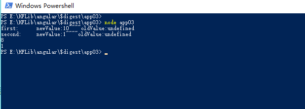

Angular 脏检查和双向数据绑定原理深层剖析
## 写在开头
关于Angular脏检查，之前没有仔细学习，只是旁听道说，Angular 会定时的进行周期性数据检查，将前台和后台数据进行比较，所以非常损耗性能。

这是大错而特错的。我甚至在新浪前端面试的时候胡说一通，现在想来真是羞愧难当! 没有深入了解就信口开河实在难堪大任。

最后被拒也是理所当然。

在剖析之前，非常感谢坐镇苏宁的[徐飞](https://github.com/xufei)，现在已经不在苏宁了，我也是在他翻译的文章（Build our own AngularJS）和博客才略懂一二。
徐飞关于知乎问题[国内前端团队分布和前景是怎样的?](https://www.zhihu.com/question/20888075/answer/40612027)的回答也是特别有意思。

## 误区纠正
首先纠正误区，Angular并不是周期性触发藏检查。
只有当UI事件，ajax请求或者 timeout 延迟事件，才会触发脏检查。
为什么叫脏检查? 对脏数据的检查就是脏检查，比较UI和后台的数据是否一致!
下面解释：

## $watch 对象。
Angular 每一个绑定到UI的数据，就会有一个 $watch 对象。
这个对象包含三个参数
``` javascript
watch = {
    name:'',      //当前的watch 对象 观测的数据名
    getNewValue:function($scope){ //得到新值
        ...
        return newValue;
        },
    listener:function(newValue,oldValue){  // 当数据发生改变时需要执行的操作
        ...
    }
}
```
getNewValue() 可以得到当前$scope 上的最新值，listener 函数得到新值和旧值并进行一些操作。
>而常常我们在使用Angular的时候，listener 一般都为空，只有当我们需要监测更改事件的时候，才会显示地添加监听。

每当我们将数据绑定到 UI 上，angular 就会向你的 watchList 上插入一个 $watch。
比如：
``` html
<span>{{user}}</span>
<span>{{password}}</span>
```
这就会插入两个$watch 对象。
之后，开始脏检查。
好了，我们先把脏检查放一放，来看它之前的东西
??
双向数据绑定 ！ 只有先理解了Angular的双向数据绑定，才能透彻理解脏检查 。

## 双向数据绑定

Angular实现了双向数据绑定。无非就是界面的操作能实事反应到数据，数据的更改也能在界面呈现。
界面到数据的更改，是由 UI 事件，ajax请求，或者timeout 等回调操作,而数据到界面的呈现则是由脏检查来做.
这也是我开始纠正的误区
** 只有当触发UI事件，ajax请求或者 timeout 延迟，才会触发脏检查。 **
看下面的例子

``` html
<div ng-controller="CounterCtrl">
    <span ng-bind="counter"></span>
    <button ng-click="counter=counter+1">increase</button>
</div>
```

``` javascript
function CounterCtrl($scope) {
    $scope.counter = 1;
}
```
毫无疑问,我每点击一次button,counter就会+1,因为点击事件,将couter+1,而后触发了脏检查,又将新值2 返回给了界面.
这就是一个简单的双向数据绑定的流程.
但是就只有这么简单吗??
看下面的代码
``` javascript

'use strict';


var app = angular.module('app', []);
app.directive('myclick', function() {
    return function(scope, element, attr) {
        element.on('click', function() {
            scope.data++;
            console.log(scope.data)

        })
    }
})
app.controller('appController', function($scope) {
    $scope.data = 0;
});


```

``` html
    <div ng-app="app">
        <div ng-controller="appController">
            <span>{{data}}</span>
            <button myclick>click</button>
        </div>
    </div>
```

点击后,毫无反应.
???
>试试在 console.log(scope.data) 后面添加 scope.\$digest(); 试试?
很明显,数据增加了。如果使用\$apply () 呢? 当然可以(后面会接受 \$apply 和 \$digest 的区别)

为什们呢？
假设没有AngularJS，要让我们自己实现这个类似的功能，该怎么做呢？

``` html
<body>
    <button ng-click="increase">increase</button>
    <button ng-click="decrease">decrease</button>
    <span ng-bind="data"></span>
    <script src="app.js"></script>
</body>

```

``` javascript

window.onload = function() {
    'use strict';

    var scope = {
        increase: function() {
            this.data++;
        },
        decrease: function decrease() {
            this.data--;
        },
        data: 0
    }

    function bind() {
        var list = document.querySelectorAll('[ng-click]');
        for (var i = 0, l = list.length; i < l; i++) {
            list[i].onclick = (function(index) {
                return function() {
                    var func = this.getAttribute('ng-click');
                    scope[func](scope);
                    apply();
                }
            })(i);
        }
    }

    // apply
    function apply() {
        var list = document.querySelectorAll('[ng-bind]');
        for (var i = 0, l = list.length; i < l; i++) {
            var bindData = list[i].getAttribute('ng-bind');
            list[i].innerHTML = scope[bindData];
        }
    }

    bind();
    apply();
}

```
测试一下：


可以看到我们没有直接使用DOM的onclick方法，而是搞了一个ng-click，然后在bind里面把这个ng-click对应的函数拿出来，绑定到onclick的事件处理函数中。为什么要这样呢？因为数据虽然变更了，但是还没有往界面上填充，我们需要在此做一些附加操作。
另外，由于双向绑定机制，在DOM操作中，虽然更新了数据的值，但是并没有立即反映到界面上，而是通过 apply() 来反映到界面上，从而完成职责的分离，可以认为是单一职责模式了。
在真正的Angular中，ng-click 封装了click，然后调用一次 apply 函数，把数据呈现到界面上
在Angular 的apply函数中，这里先进行脏检测，看 oldValue 和 newVlue 是否相等，如果不相等，那么讲newValue 反馈到界面上，通过如果通过 $watch 注册了 listener事件，那么就会调用该事件。

## 脏检查的优缺点
经过我们上面的分析，可以总结：
- 简单理解，一次脏检查就是调用一次 $apply() 或者 $digest(),将数据中最新的值呈现在界面上。
- 而每次 UI 事件变更，ajax 还有 timeout 都会触发 $apply()。

然而就有了接下来的讨论?

不断触发脏检查是不是一种好的方式？
有很多人认为，这样对性能的损耗很大，不如 setter 和 getter 的观察者模式。 但是我们看下面这个例子
```html
<span>{{checkedItemsNumber}}</span>
```

``` javascript
function Ctrl($scope){
   var  list = [];
   $scope.checkedItemsNumber = 0;
   for(var i = 0;i<1000;i++){
    list.push(false);
   } 
   $scope.toggleChecked = function(flag){
    for(var i = 0,l= list.length;i++){
        list[i] = flag;
        $scope.checkedItemsNumber++;
    }
   }
}

```

在脏检测的机制下，这个过程毫无压力，会等待到 循环执行结束，然后一次更新  checkedItemsNumber，应用到界面上。 但是在基于setter的机制就惨了，每变化一次checkedItemsNumber就需要更新一次，这样性能就会极低。
所以说，两种不同的监控方式，各有其优缺点，最好的办法是了解各自使用方式的差异，考虑出它们性能的差异所在，在不同的业务场景中，避开最容易造成性能瓶颈的用法。

好了，现在已经了解了双向数据绑定了 脏检查的触发机制，那么，脏检查内部又是怎么实现的呢？

## 脏检查的内部实现
首先，构造$scope 对象，

``` javascript
function $scope = function(){}
```
现在，我们回到开头 $watch。
我们说，每一个绑定到UI上的数据都有拥有一个对应的$watch 对象，这个对象会被push到watchList中。
它拥有两个函数作为属性
- getNewValue() 也叫监控函数，勇于在值发生变化后得到提示，并返回新值。
- listener() 监听函数，用于在数据变更的时候响应行为。
还有一个字符串属性
- name： 当前watch作用的变量名
``` javascript
function $scope(){
   this. $$watchList = [];
}
```
>在Angular框架中，双美元符前缀$$表示这个变量被当作私有的来考虑，不应当在外部代码中调用。

现在我们可以定义$watch方法了。它接受两个函数作参数，把它们存储在$$watchers数组中。我们需要在每个Scope实例上存储这些函数，所以要把它放在Scope的原型上：
``` javascript
$scope.prototype.$watch = function(name,getNewValue,listener){
    var watch = {
       name:name,
       getNewValue : getNewValue,
       listener : listener
    };

    this.$$watchList.push(watch);
}
```
另外一面就是$digest函数。它执行了所有在作用域上注册过的监听器。我们来实现一个它的简化版，遍历所有监听器，调用它们的监听函数：
``` javascript
$scope.prototype.$digest = function(){
    var list = this.$$watchList;
    for(var i = 0,l = list.length;i<l;i++){
        list[i].listener();
    }
}
```

现在，我们就可以添加监听器并且运行脏检查了。
```javascript
var scope = new Scope();
scope.$watch(function() {
    console.log("hey i have got newValue")
}, function() {
    console.log("i am the listener");
})

scope.$watch(function() {
    console.log("hey i have got newValue 2")
}, function() {
    console.log("i am the listener2");
})

scope.$disget();
```


> 代码会托管到github，测试文件路径跟命令中路径一致

OK,两个监听均已经触发。
这些本身没什么大用，我们要的是能检测由getNewValue返回指定的值是否确实变更了，然后调用监听函数。
那么，我们需要在getNewValue() 上每次都得到数据上最新的值,所以需要得到当前的scope对象
```javascript
getNewValue = function(scope){
    return scope[this.name];
}
```
>是监控函数的一般形式：从作用域获取一些值，然后返回。

$digest函数的作用是调用这个监控函数，并且比较它返回的值和上一次返回值的差异。如果不相同，监听器就是脏的，它的监听函数就应当被调用。

想要这么做，$digest需要记住每个监控函数上次返回的值。既然我们现在已经为每个监听器创建过一个对象，只要把上一次的值存在这上面就行了。下面是检测每个监控函数值变更的$digest新实现：
```javascript
$scope.prototype.$digest = function(){
    var list = this.$$watchList;
    for(var i = 0,l= list.length;i++){
        var watch = list[i];
        var newValue = watch.getNewValue(this);
        // 在第一次渲染界面,进行一个数据呈现.
        var oldValue = watch.last;
        if(newValue!=oldValue){
            watch.listener(newValue,oldValue);
        }
        watch.last = newValue;
    }
}
```

对于每一个watch,我们使用 getNewValue() 并且把scope实例 传递进去,得到数据最新值 。然后和上一次值进行比较，如果不同，那就调用 getListener，同时把新值和旧值一并传递进去。 最终，我们把last 属性设置为新返回的值，也就是最新值。
这个$digest 再一次调用，last 为undefined，所以一定会进行一次数据呈现。

好了，我们看看这个监控函数如何运行的
```javascript

var scope = new $scope();
scope.hello = 10;
scope.$watch('hello', function(scope) {
    // 注意，要理解这里的this ，这个函数实际是  var newValue = watch.getNewValue(this); 这样调用，那么 this 就指的是当前监听器watch，所以可以得到name
        return scope[this.name]
    },
    function(newValue, oldValue) {
        console.log('newValue:' + newValue + '~~~~' + 'oldValue:' + oldValue);
    })
scope.$digest();
scope.hello = 10;
scope.$digest();
scope.hello = 20;
scope.$digest();
 
```
运行结果


我们已经实现了Angular作用域的本质：添加监听器，在digest里运行它们。

也已经可以看到几个关于Angular作用域的重要性能特性：
- 在作用域上添加数据本身并不会有性能折扣。如果没有监听器在监控某个属性，它在不在作用域上都无所谓。Angular并不会遍历作用域的属性，它遍历的是监听器。一旦将数据绑定到UI上，就会添加一个监听器。
- $digest里会调用每个getNewValue(),因此，最好关注监听器的数量，还有每个独立的监控函数或者表达式的性能。

## 有时候并不需要注册那么多的Listener
在看我们上面的程序：
```javascript
$scope.prototype.$digest = function(){
    var list = this.$$watchList;
    for(var i = 0,l= list.length;i++){
        var watch = list[i];
        var newValue = watch.getNewValue(this);
        // 在第一次渲染界面,进行一个数据呈现.
        var oldValue = watch.last;
        if(newValue!=oldValue){
            watch.listener(newValue,oldValue);
        }
        watch.last = newValue;
    }
}
```

我们这样做，就要求每个监听器watch 都必须注册 listener，然而事实是：在Angular 应用中，只有少数的监听器需要注册listener。
更改 $scope.prototype.$wacth,在这里放置一个空的函数。
```javascript
$scope.prototype.$watch = function(name,getNewValue,listener){
    var watch = {
       name:name,
       getNewValue : getNewValue,
       listener : listener || function(){}
    };

    this.$$watchList.push(watch);
}
```

貌似这样已经初步理解了脏检查原理，但是一个重要的问题我们忽视了。
先后注册了两个监听器，第二个监听器的listener 改变了 第一个监听器对应数据的值，那么这么做会检测的到吗？
看下面的例子


```javascript

var scope = new $scope();
scope.first = 10;
scope.second = 1;
scope.$watch('first', function(scope) {
        return scope[this.name]
    },
    function(newValue, oldValue) {
        console.log('first:      newValue:' + newValue + '~~~~' + 'oldValue:' + oldValue);
    })

scope.$watch('second', function(scope) {
        return scope[this.name]
    },
    function(newValue, oldValue) {
        scope.first = 8;
        console.log('second:     newValue:' + newValue + '~~~~' + 'oldValue:' + oldValue);
    })
scope.$digest();
console.log(scope.first);
console.log(scope.second);

```

可以看到，值为 8，1，已经发生改变，但是界面上的值却没有改变。

现在来修复这个问题。
##当数据脏的时候持续Digest

我们需要改变一下digest，让它持续遍历所有监听器，直到监控的值停止变更。

首先，我们把现在的$digest函数改名为$$digestOnce，它把所有的监听器运行一次，返回一个布尔值，表示是否还有变更了。
``` javascript
$scope.prototype.$$digestOnce = function() {
  var dirty;
  var list = this.$$watchList;

  for(var i = 0,l = list.length;i<l;i++ ){
    var watch = list[i];
    var newValue = watch.getNewValue(this.name);
    var oldValue = watch.last;
    if(newValue !==oldValue){
        watch.listener(newValue,oldValue);
        // 因为listener操作，已经检查过的数据可能变脏
        dirty = true;
    }

     watch.last = newValue;
     return dirty;
    }
};
```

然后，我们重新定义$digest，它作为一个“外层循环”来运行，当有变更发生的时候，调用$$digestOnce：

```javascript
$scope.prototype.$digest = function() {
  var dirty = true;
  while(dirty) {
    dirty = this.$$digestOnce();
  } 
};
```
$digest现在至少运行每个监听器一次了。如果第一次运行完，有监控值发生变更了，标记为dirty，所有监听器再运行第二次。这会一直运行，直到所有监控的值都不再变化，整个局面稳定下来了。

>在Angular作用域里并不是真的有个函数叫做$$digestOnce，相反，digest循环都是包含在$digest里的。我们的目标更多是清晰度而不是性能，所以把内层循环封装成了一个函数。

测试一下
``` javascript
var scope = new $scope();
scope.first = 10;
scope.second = 1;
scope.$watch('first', function(scope) {
        return scope[this.name]
    },
    function(newValue, oldValue) {
        console.log('first:      newValue:' + newValue + '~~~~' + 'oldValue:' + oldValue);
    })

scope.$watch('second', function(scope) {
        return scope[this.name]
    },
    function(newValue, oldValue) {
        scope.first = 8;
        console.log('second:     newValue:' + newValue + '~~~~' + 'oldValue:' + oldValue);
    })
scope.$digest();
console.log(scope.first);
console.log(scope.second);
```


可以看到，现在界面上的数据已经全部为最新
我们现在可以对Angular的监听器有另外一个重要认识：它们可能在单次digest里面被执行多次。这也就是为什么人们经常说，监听器应当是幂等的：一个监听器应当没有边界效应，或者边界效应只应当发生有限次。比如说，假设一个监控函数触发了一个Ajax请求，无法确定你的应用程序发了多少个请求。

如果两个监听器循环改变呢？像现在这样：
``` javascript
var scope = new $scope();
scope.first = 10;
scope.second = 1;
scope.$watch('first', function(scope) {
        return scope[this.name]
    },
    function(newValue, oldValue) {
       scope.second ++;
    })

scope.$watch('second', function(scope) {
        return scope[this.name]
    },
    function(newValue, oldValue) {
        scope.first ++;
    })
```
那么，脏检查就不会停下来，一直循环下去。如何解决呢？

## 更稳定的 $digest
我们要做的事情是，把digest的运行控制在一个可接受的迭代数量内。如果这么多次之后，作用域还在变更，就勇敢放手，宣布它永远不会稳定。在这个点上，我们会抛出一个异常，因为不管作用域的状态变成怎样，它都不太可能是用户想要的结果。

迭代的最大值称为TTL（short for Time To Live）。这个值默认是10，可能有点小（我们刚运行了这个digest 100,000次！），但是记住这是一个性能敏感的地方，因为digest经常被执行，而且每个digest运行了所有的监听器。用户也不太可能创建10个以上链状的监听器。

我们继续，给外层digest循环添加一个循环计数器。如果达到了TTL，就抛出异常：

``` javascript
$scope.prototype.$digest = function() {
  var dirty = true;
  var checkTimes = 0;
  while(dirty) {
    dirty = this.$$digestOnce();
    checkTimes++;
    if(checkTimes>10 &&dirty){
        throw new Error("检测超过10次");
        console.log("123");
    }
  };
};
```

测试一下
``` javascript
var scope = new $scope();
scope.first = 1;
scope.second = 10;
scope.$watch('first', function(scope) {
        return scope[this.name]
    },
    function(newValue, oldValue) {
        scope.second++;
        console.log('first:      newValue:' + newValue + '~~~~' + 'oldValue:' + oldValue);
    })

scope.$watch('second', function(scope) {
        return scope[this.name]
    },
    function(newValue, oldValue) {
        scope.first++;
        console.log('second:     newValue:' + newValue + '~~~~' + 'oldValue:' + oldValue);
    })
scope.$digest();
```

好了，关于 Angular 脏检查和 双向数据绑定原理就介绍到这里，虽然离真正的Angular 还差很多，但是也能基本解释原理了。
推荐一本原著  《Build Your Own AngularJS》，书中详细介绍了如何构建一个AngularJS。估计翻译版本会在年后出版，如果可以读完这本书，那么 JS的能力将会上升一个等级。
关于司徒正美的 《Javascript框架设计》 也是前端深入研究的必读之书。
后面在阅读的时候，我会把自己的阅读经验分享出来。

只是把这些搞明白之后，再也没有去面试新浪的机会了 。
虽然不知道明年会在哪，但一定会进入一个优秀的前端团队并努力展示更好的面貌的。
如果您有意，欢迎联系我,Email:mymeat@126.com

在这篇中，我有提到 VueJS 中 基于 setter 和 getter 的实现，我讲会深入学习并在下一篇介绍。