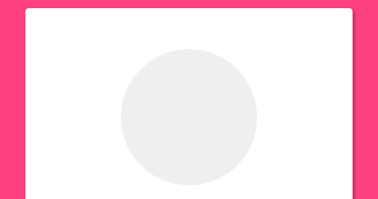
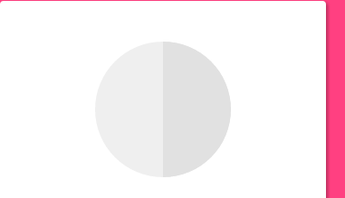
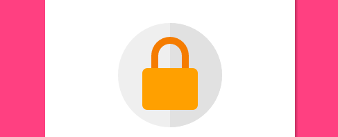
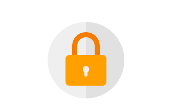
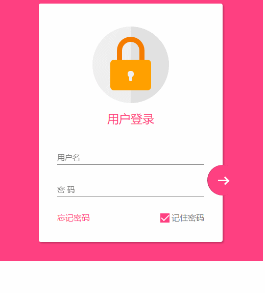

心血来潮,想学学 material design 的设计风格,就尝试完成了一个登录页面制作.
这是整体效果.


感觉还不错吧,结尾会附上代码

在编写的过程中,没有使用任何图片或者字体图标,全部使用css3完成,还是遇到一些难点和bug,所以想笔记下来,以后方便查阅.

### 响应式设计
在这个页面中,使用下面3点来完成响应式设计
- 最大宽度 .设定了一个 max-width 的最大宽度,以便在大屏幕时兼容.
- margin : 20px auto; 使其保持时刻居中
- 组件使用像素
### 整体页面布局

``` html
<!DOCTYPE html>
<html lang="en">

<head>
    <meta charset="UTF-8">
    <title>Document</title>
    <meta http-equiv="X-UA-Compatible" content="IE=edge,chrome=1">
    <meta name="viewport" content="width=device-width, initial-scale=1.0">
    <link rel="stylesheet" href="styles/style.css">
</head>

<body>
    <div class="container">
        <div class="logo">
            <div class="logo-block-top">
            </div>
            <div class="logo-block-bottom">
            </div>
        </div>
        <h4 class="login-header">用户登录</h4>
        <div class="content">
            <div class="form-group">
                <input type="text" required class="form-control">
                <label class="form-label">用户名</label>
            </div>
            <div class="form-group">
                <input type="text" required class="form-control">
                <label class="form-label">密 码</label>
            </div>
            <div class="option">
                <div class="option-left"><a href="">忘记密码</a></div>
                <div class="option-right">
                    <span class="md-checkbox" checked="checked"></span>
                    <label class="form-label">记住密码</label>
                </div>
            </div>
        </div>
        <button class="login-button">
            <span class="icon-login"></span>
        </button>
    </div>
</body>
<script src="./app.js type=" text/javascript "></script>

</html>


```

### CSS 开始


给 body 添加样式
``` css
html {
    font-family: "Microsoft YaHei", 宋体, "Segoe UI", "Lucida Grande", Helvetica, Arial, sans-serif, FreeSans, Arimo;
    background-color: #FF4081;
    color: #777;
}
```
版心 
``` css
.container{
    position: relative;
    max-width: 360px;
    margin: 0 auto;
    margin-top: 30px;
    padding: 45px 20px;
    border-radius: 4px;
    box-shadow: 2px 2px 5px rgba(0, 0, 0, 0.3);
    background-color: #fff;
    box-sizing: border-box;
}

```
> 注意,这里调整内部边距使用了padding 而不是对子元素使用margin,因为如果要使用margin,为了BFC 的效果,就需要加上 overflow: hidden. 这样就会对尾部按钮溢出产生影响.


头部logo

``` css
.container>.logo {
    height: 150px;
    width: 150px;
    position: relative;
    background-color: #EFEFEF;
    border-radius: 75px;
    margin: 0 auto;
}

```

> 设置 border-radius 为 width和height的一般,就会使其成为一个圆
> 

下面需要一个颜色更深的半圆
如何绘制一个半圆?
``` css
.container>.logo::after {
    content: ' ';
    height: 150px;
    width: 75px;
    position: absolute;
    background-color: #E1E1E1;
    border-radius: 0 75px 75px 0;
    left: 75px;
    top: 0;
}
```

> 设置宽度为高度的一般,然后设置左上角和左下角圆角为0,右边为75px
> 

制作锁,分为两部分,lock-top 和 lock -bottom
```css
.container>.logo>.logo-block-top {
    box-sizing: border-box;
    height: 45px;
    width: 54px;
    border: 10px solid #F57C00;
    border-bottom: 0;
    position: absolute;
    border-radius: 27px 27px 0 0;
    left: 48px;
    z-index: 1001;
    top: 20px;
}
```
> 同样是设置圆角

``` css
.container>.logo>.logo-block-bottom {
    position: absolute;
    height: 60px;
    width: 80px;
    box-sizing: border-box;
    background-color: #FFA000;
    z-index: 1001;
    top: 65px;
    left: 35px;
    border-radius: 7px;
}
```



设置钥匙心,这个也分为两部分,上面的圆孔和和下面的椭圆
刚好可以设置在 lock-bottom 的 before和after伪元素上面
``` css
.container>.logo>.logo-block-bottom::before {
    content: " ";
    position: absolute;
    height: 12px;
    width: 12px;
    background-color: #EFEFEF;
    border-radius: 5px;
    top: 22px;
    left: 34px;
    box-sizing: border-box;
}
.container>.logo>.logo-block-bottom::after {
    content: " ";
    position: absolute;
    height: 12px;
    width: 6px;
    background-color: #EFEFEF;
    border-radius: 2px;
    top: 30px;
    left: 37px;
    box-sizing: border-box;
}
```

到这里 logo 就完成了



下面是 ' 用户登录 ' 标题.
注意,这里最好使用margin 而不是padding,不要破坏原有h4 标签.
``` css
.container>.login-header {
    text-align: center;
    font-size: 23px;
    color: #FF4081;
    font-weight: 400;
    margin: 15px 0 18px 0;
}
```

为内容添加一个容器
``` css
.container>.content {
    width: 90%;
    margin: 0 auto;
}
```

添加一个 form-group,包含 label和input 标签,设置相对布局
``` css
.container>.content>.form-group {
    position: relative;
}
```

下面就是核心部分,为input 设置样式(这里会产生一个bug,在结尾会介绍)
``` css
.container>.content>.form-group>.form-control {
    z-index: 3;
    position: relative;
    height: 58px;
    width: 100%;
    border: 0px;
    border-bottom: 1px solid #777;
    padding-top: 22px;
    color: #FF4081;
    font-size: 12px;
    background: none;
    box-sizing: border-box;
    outline: none;
    display: inline-block;
    -webkit-transition: 0.3s;
    transition: 0.3s;
}
```

labe 标签,使用绝对定位,将其放置到Input的上面.
``` css
.container>.content>.form-group>.form-label {
    z-index: 1;
    position: absolute;
    bottom: 10px;
    left: 0;
    font-size: 15px;
    -webkit-transition: 0.3s;
    transition: 0.3s;
}
```
为两个form group 设置一定的间距,否则下面会挡住上面设置的 box-shadow

``` css
.container>.content>.form-group>:first-child {
    margin-bottom: 5px;
}
```

添加动态效果
``` css
.container>.content>.form-group>.form-control:focus,
.container>.content>.form-group>.form-control:valid {
    box-shadow: 0 1px #FF4081;
    border-color: #FF4081;
}

.container>.content>.form-group>.form-control:focus+.form-label,
.container>.content>.form-group>.form-control:valid+.form-label {
    font-size: 12px;
    -ms-transform: translateY(-20px);
    -webkit-transform: translateY(-20px);
    transform: translateY(-25px);
}
```

下面就到了底部option ,也分为两部分,option-left 和 option-right

``` css
.container>.content>.option {
    width: 100%;
    height: 14px;
    margin-top: 24px;
    font-size: 16px;
}

.container>.content>.option>.option-left {
    width: 50%;
    float: left;
}

.container>.content>.option>.option-left>a,
.container>.content>.option>.option-left>a:hover {
    color: #FF4081;
    text-decoration: none;
}

```

在option-right 中,要注意 这个复选框并不是原生的Input,而是使用div 旋转而得,因为原生的checkbox无法更改样式.
``` css

.container>.content>.option>.option-right {
    width: 50%;
    float: right;
    text-align: right;
    position: relative;
}

.container>.content>.option>.option-right>.md-checkbox {
    height: 18px;
    width: 18px;
    display: inline-block;
    box-sizing: border-box;
    position: absolute;
    background-color: #FF4081;
    cursor: pointer;
    position: absolute;
    top: 3px;
    right: 68px;
}

.container>.content>.option>.option-right>.md-checkbox[checked]:after {
    content: " ";
    border-left: 2px solid #fff;
    border-bottom: 2px solid #fff;
    height: 8px;
    width: 15px;
    box-sizing: border-box;
    position: absolute;
    transform: rotate(-45deg);
    top: 3px;
    left: 2px;
}

```
> 这里使用css3 中的旋转,而模仿一个选中效果
> 注意: 虽然div无法直接选中,但还是可以为其添加一个checkd属性, 这个属性是一个特殊的css 事件效果,可以通过js来控制.

最后,登录按钮.
这里,也必须使用绝对定位,参照点是bottom和right
``` css
.container>.login-button {
    position: absolute;
    height: 60px;
    width: 60px;
    border: 0px;
    outline: 0px;
    background-color: #FF4081;
    border-radius: 30px;
    right: -30px;
    bottom: 91px;
    box-shadow: 2px 0 0 rgba(0, 0, 0, 0.3) inset;
}
```
通过  box-shadow: 2px 0 0 rgba(0, 0, 0, 0.3) inset; 这句话可以知道一个内嵌效果.
中间的按钮在不适用字体图标的情况下也必须要用div 旋转来模仿了
``` css
.container>.login-button >.icon-login {
    box-sizing: border-box;
    position: relative;
    width: 18px;
    height: 3px;
    background-color: #fff;
    transition: 0.3s;
    display: block;
    margin: auto;
}

.container>.login-button >.icon-login::after {
    content: ' ';
    box-sizing: border-box;
    position: absolute;
    left: 8px;
    height: 12px;
    width: 12px;
    border-top: 3px solid #fff;
    border-right: 3px solid #fff;
    transform: rotate(45deg);
    top: -4px;
}

```
最后是鼠标hover上的放大和阴影效果

``` css
.container>.login-button:hover {
    box-shadow: 0 0 0 rgba(0, 0, 0, 0.3) inset, 0 3px 6px rgba(0, 0, 0, 0.16), 0 5px 11px rgba(0, 0, 0, 0.23)
}

.container>.login-button:hover>.icon-login {
    -ms-transform: scale(1.2);
    =webkit-transform: scale(1.2);
    transform: scale(1.2);
}
```

至此,所有的css已经结束了,查看效果



### transition bug修复

当我刷新页面或者点击忘记密码的时候,input框就会抖动一下，这个问题只会出现在chrome 浏览器上，firefox 或者edge都不会重现，所以我才这应该是兼容性的问题。
在不断尝试中，我发现，只有取消 transition属性，就不会产生抖动。

这个问题困扰了我3天，真实百思不得其姐。
在某度中查询半天，未果 。
后来终于在 StackOverFlow 中，搜索chrome input transition 时，终于一个回到让我貌似顿开。

```
this bug has been reported， adding an script tag somewhere can advoid it.
```

之后，我在页面尾部添加一个下面节点，终于顺利解决。
``` html
<script src="./app.js type=" text/javascript "></script>
```
在阅读过一些文章之后，总结为 
> 当chrome 的input 默认属性向自定义过度时，因为存在transition，所以会产生抖动。
> 而基本上所有的页面都有script标签，所以这个bug 几乎很难被重现。
> 而我遇到，算是运气不好吧。。
> 
至此，这个页面全部内容已经完成。
material-design 很赞，angular-material 是使用 AngularJS 封装了 material-design 的UI 库，很漂亮。不同于 bootstrap的完全扁平化风格，它采用的是盒子堆砌效果，动画效果也比较赞。
在下面的一段时间，想着重研究研究这个UI库。
其实国内的妹子UI 也挺棒，github 上面的star 也很多，但是因为bootstrap太优秀，把它直接盖过了。

代码托管至github